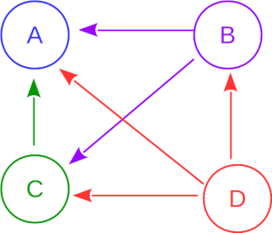
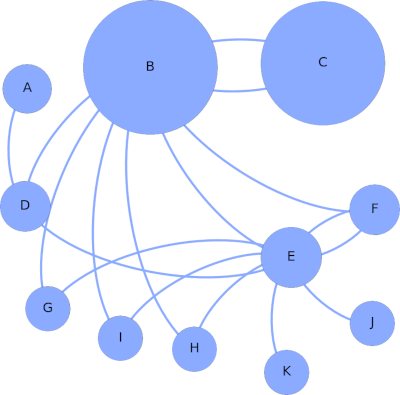
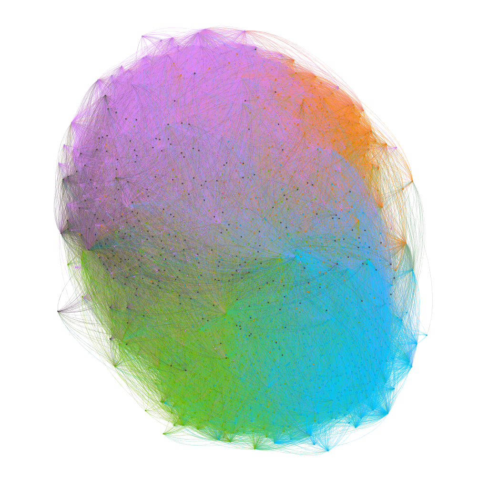
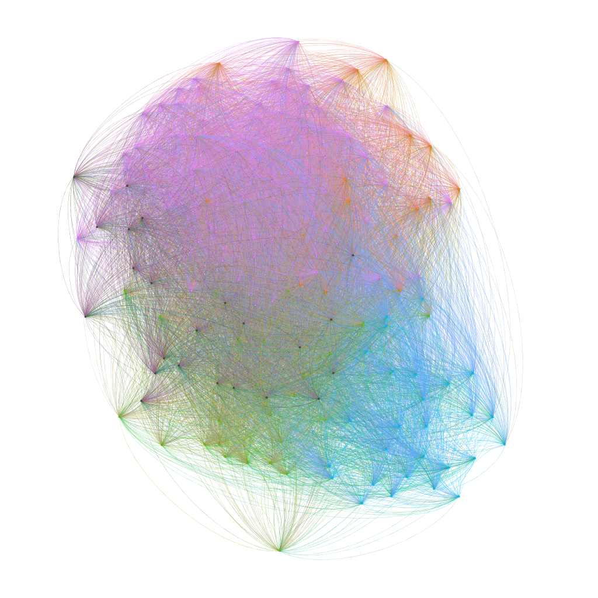

# Neo4j e Cypher - Conceitos Básicos

Entre no Sandbox do Cypher: https://neo4j.com/

Há uma opção de se usar o Neo4j online através de um sandbox em: https://neo4j.com/sandbox-v2/

Crie uma conta e abra um `Blank Sandbox`. Abaixo segue um tutorial a ser executado nesse sandbox.

### Simple Example

The `pagerank` directory has examples of the centrality algorithm PageRank.

In the first example, you are invited to produce a Comma Separated Value (CSV) departing from the following graph:

.

The produced file is like the following: [pagerank-simple.cvs](../../pagerank/pagerank-simple.csv). It is the starting point.

The following loads the CSV into a Neo4J graph:

~~~cypher
LOAD CSV WITH HEADERS FROM 'https://raw.githubusercontent.com/santanche/lab2learn/master/network/pagerank/pagerank-simple.csv' AS line
MERGE (p1:Page {name:line.Source})
MERGE (p2:Page {name:line.Target})
CREATE (p1)-[:LINKS]->(p2)
~~~

Showing the graph:

~~~cypher
MATCH (n)
RETURN n
~~~

The following Pagerank algorithm can be applied in the graph. It is based on [The PageRank algorithm](https://neo4j.com/docs/graph-algorithms/3.5/algorithms/page-rank/).

~~~cypher
CALL gds.graph.create(
  'prGraph',
  'Page',
  'LINKS'
)

CALL gds.pageRank.stream('prGraph')
YIELD nodeId, score
RETURN gds.util.asNode(nodeId).name AS name, score
ORDER BY score DESC, name ASC
~~~

It produces the following result:

~~~csv
name	score
"A"	0.5074781282804907
"C"	0.2743125001899898
"B"	0.19250000063329936
"D"	0.15000000000000002
~~~

### Exercise - Wikipedia Example

Following the previous steps, you can depart from the file [pagerank-wikipedia.csv](../../pagerank/pagerank-wikipedia.csv) to create the example illustrated in Wikipedia: https://en.wikipedia.org/wiki/PageRank.

Compute the Pagerank of the Wikipedia example in Cypher:

~~~cypher
=== response ===
~~~

## Community

There are [Community Detection Algoritms in Neo4J](https://neo4j.com/docs/graph-algorithms/3.5/algorithms/community/) the you can use in the following data.

### Exercise - Simple Comunity

The following example (inside the `community` directory) shows data to compute communities in a simple graph.

The graph is produced starting from the following CSV file: [community-simple.csv](../../community/community-simple.csv).

The resulting expected graph can be seen in the illustration below.

Detect this Comunity in Cypher:

~~~cypher
=== response ===
~~~

## Symptoms–disease network

In the directory `symptoms-disease` congregates a CSV file from the following paper adapted for Gephi: [ncomms5212-s5_gephi.tsv](symptoms-disease/ncomms5212-s5_gephi.tsv).

> Zhou, X., Menche, J., Barabási, A.-L., & Sharma, A. (2014). Human symptoms–disease network. Nature Communications, 5(1), 4212. https://doi.org/10.1038/ncomms5212

You can try to run the comunity algorithm in this dataset.

