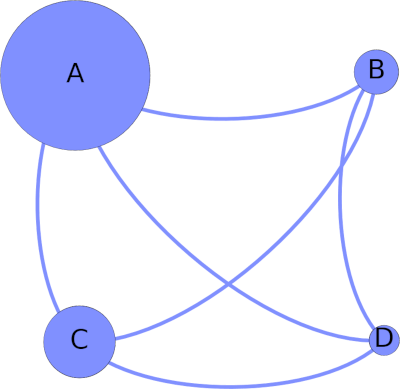
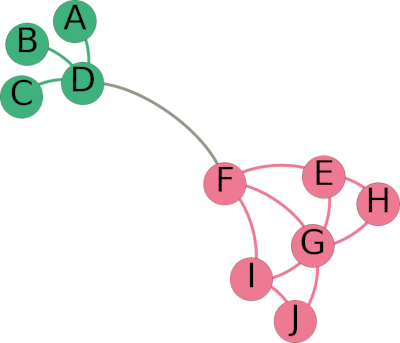

# Neo4j e Cypher - Conceitos Básicos

Entre no Sandbox do Cypher: https://neo4j.com/

Há uma opção de se usar o Neo4j online através de um sandbox em: https://neo4j.com/sandbox/

Crie uma conta e abra um `Blank Sandbox`. Abaixo segue um tutorial a ser executado nesse sandbox.

### Simple Example

The `pagerank` directory has examples of the centrality algorithm PageRank.

In the first example, you are invited to produce a Comma Separated Value (CSV) departing from the following graph:

.

The produced file is like the following: [pagerank-simple.cvs](../../pagerank/pagerank-simple.csv). It is the starting point.

The following loads the CSV into a Neo4J graph:

~~~cypher
LOAD CSV WITH HEADERS FROM 'https://raw.githubusercontent.com/santanche/lab2learn/master/network/pagerank/pagerank-simple.csv' AS line
MERGE (p1:Page {name:line.source})
MERGE (p2:Page {name:line.target})
CREATE (p1)-[:LINKS]->(p2)
~~~

Showing the graph:

~~~cypher
MATCH (n:Page)
RETURN n
~~~

The following sentence creates a native projection of a Neo4j graph or subgraph in memory. `prGraph` is the name of the graph; `Page` is the class of the projected nodes; `LINKS` is the class of projected edges:

~~~cypher
CALL gds.graph.create(
  'prGraph',
  'Page',
  'LINKS'
)
~~~

See details of native projections at [Native projection](https://neo4j.com/docs/graph-data-science/current/management-ops/native-projection/).

The following Pagerank algorithm can be applied in the named graph (`prGraph`). It is based on [PageRank](https://neo4j.com/docs/graph-data-science/current/algorithms/page-rank/):

~~~cypher
CALL gds.pageRank.stream('prGraph')
YIELD nodeId, score
RETURN gds.util.asNode(nodeId).name AS name, score
ORDER BY score DESC, name ASC
~~~

It produces the following result:

~~~csv
name	score
"A"	0.5074781282804907
"C"	0.2743125001899898
"B"	0.19250000063329936
"D"	0.15000000000000002
~~~

Transfering Page Tank to nodes:

~~~cypher
CALL gds.pageRank.stream('prGraph2')
YIELD nodeId, score
MATCH (p:Page {name: gds.util.asNode(nodeId).name})
SET p.pagerank = score
~~~

### Exercise - Wikipedia Example

Following the previous steps, you can depart from the file [pagerank-wikipedia.csv](../../pagerank/pagerank-wikipedia.csv) to create the example illustrated in Wikipedia: https://en.wikipedia.org/wiki/PageRank.

Compute the Pagerank of the Wikipedia example in Cypher:

~~~cypher
=== response ===
~~~

## Community

There are [Community Detection Algoritms](https://neo4j.com/docs/graph-data-science/current/algorithms/community/) the you can use in the following data.

### Exercise - Simple Comunity

The following example (inside the `community` directory) shows data to compute communities in a simple graph.

The graph is produced starting from the following CSV file: [community-simple.csv](../../community/community-simple.csv).

The resulting expected graph can be seen in the illustration below.

Detect this Community in Cypher:

Loading the CSV:

~~~cypher
LOAD CSV WITH HEADERS FROM 'https://raw.githubusercontent.com/santanche/lab2learn/master/network/community/community-simple.csv' AS line
MERGE (p1:Person {name:line.source})
MERGE (p2:Person {name:line.target})
CREATE (p1)-[:FRIEND]->(p2)
~~~

Showing the graph:

~~~cypher
MATCH (n:Person)
RETURN n
~~~

Creating a native projection:

~~~cypher
CALL gds.graph.create(
  'communityGraph',
  'Person',
  {
    FRIEND: {
      orientation: 'UNDIRECTED'
    }
  }
)
~~~

Detecting a community using a Louvain algorithm:

~~~cypher
CALL gds.louvain.stream('communityGraph')
YIELD nodeId, communityId
RETURN gds.util.asNode(nodeId).name AS name, communityId
ORDER BY communityId ASC
~~~

~~~cypher
=== response ===
~~~

## Exercise - FAERS & DRON

Departing from a Drug-Drug graph created in a previous lab, whose relationship determines drugs taken together, apply a community detection in it to see the results.

Apply this community with and without weights.

Sequence to build the graph:

~~~cypher
LOAD CSV WITH HEADERS FROM 'https://raw.githubusercontent.com/santanche/lab2learn/master/data/faers-2017/drug.csv' AS line
CREATE (:Drug {code: line.code, name: line.name})
~~~

~~~cypher
CREATE INDEX ON :Drug(code)
~~~

~~~cypher
LOAD CSV WITH HEADERS FROM 'https://raw.githubusercontent.com/santanche/lab2learn/master/data/faers-2017/pathology.csv' AS line
CREATE (:Pathology { code: line.code, name: line.name})
~~~

~~~cypher
CREATE INDEX ON :Pathology(code)
~~~

~~~cypher
LOAD CSV WITH HEADERS FROM 'https://raw.githubusercontent.com/santanche/lab2learn/master/data/faers-2017/drug-use.csv' AS line
MATCH (d:Drug {code: line.codedrug})
MATCH (p:Pathology {code: line.codepathology})
MERGE (d)-[t:Treats]->(p)
ON CREATE SET t.weight=1
ON MATCH SET t.weight=t.weight+1
~~~

~~~cypher
MATCH (d1:Drug)-[a]->(p:Pathology)<-[b]-(d2:Drug)
WHERE a.weight > 20 AND b.weight > 20
MERGE (d1)<-[r:Relates]->(d2)
ON CREATE SET r.weight=1
ON MATCH SET r.weight=r.weight+1
~~~

~~~cypher
MATCH (d1:Drug)<-[:Relates]->(d2:Drug)
RETURN d1, d2
LIMIT 20
~~~

~~~cypher
=== response ===
~~~

## Symptoms–disease network

In the directory `symptoms-disease` congregates a CSV file from the following paper adapted for Gephi: [ncomms5212-s5_gephi.tsv](symptoms-disease/ncomms5212-s5_gephi.tsv).

> Zhou, X., Menche, J., Barabási, A.-L., & Sharma, A. (2014). Human symptoms–disease network. Nature Communications, 5(1), 4212. https://doi.org/10.1038/ncomms5212

You can try to run the comunity algorithm in this dataset.

