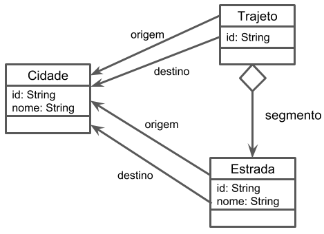
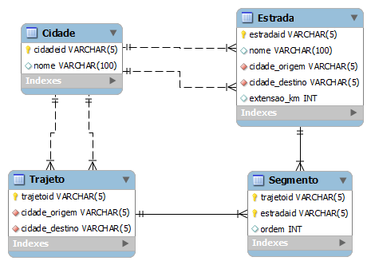

# Estradas e Trajetos

Considere o diagrama abaixo representa graficamente um modelo relacional de tabelas que controlam cidades, estradas e trajetos entre cidades. A seguir a descrição o papel de cada tabela:
* _Cidades_: mantém um cadastro de cidades.
* _Estradas_: registra estradas que ligam uma cidade (cidade_origem) a outra (cidade_destino), bem como sua quilometragem.
* _Trajeto_: cada registro da tabela Trajeto identifica um trajeto, que consiste em uma sequência ordenada de estradas que ligam duas cidades (cidade_origem e cidade_destino), por exemplo, um trajeto entre Salvador e Curitiba, pode envolver uma sequência de estradas: Salvador-Belo Horizonte, Belo Horizonte-São Paulo e São Paulo-Curitiba. Um Trajeto agrega um conjunto de Segmentos.
* _Segmento_: associa estradas a trajetos. O campo ordem é um campo numérico sequencial (iniciado de 1 para cada trajeto) usado para ordenar os segmentos (estradas) dentro de um trajeto.

 
